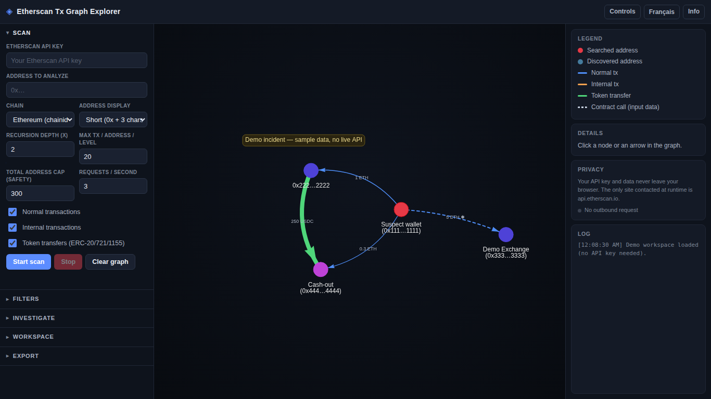

# chainmap

[](https://github.com/gl0bal01/chainmap/actions/workflows/ci.yml)

[English](README.md) · **Français**

> **Cartographiez la blockchain.** Transformez des transactions on-chain brutes en un graphe
> interactif de flux de fonds — pour les enquêteurs OSINT, les journalistes et celles et ceux
> qui apprennent le fonctionnement des blockchains.

Collez une adresse → chainmap récupère ses transactions via l'API Etherscan v2 et dessine un
graphe orienté **adresse → adresse**, étendu en largeur (BFS) jusqu'à la profondeur de votre
choix. Puis il superpose des outils d'enquête : filtres, regroupement d'arêtes, décodage des
appels de contrat, détection de cycles, hubs puits/source et score de risque par nœud.

- **Entièrement côté client** — aucun backend, aucune étape de build, aucune télémétrie.
- **Votre clé API et vos données restent dans votre navigateur.** Le seul site jamais
  contacté est `api.etherscan.io`, imposé par une Content-Security-Policy stricte.
- **Anglais + français**, entièrement localisé.
- **321 tests** unitaires / d'intégration sur le cœur sans DOM.



---

## Sommaire

- [Démarrage rapide](#démarrage-rapide)
- [Fonctionnalités](#fonctionnalités)
- [Comprendre la blockchain](#comprendre-la-blockchain)
- [Architecture](#architecture)
- [Confidentialité, sécurité et éthique](#confidentialité-sécurité-et-éthique)
- [Développement et tests](#développement-et-tests)
- [Chaînes prises en charge](#chaînes-prises-en-charge)

---

## Démarrage rapide

Aucune installation — ce sont des modules ES natifs.

```bash
git clone https://github.com/gl0bal01/chainmap.git && cd chainmap
python3 -m http.server 8000
# ouvrez http://localhost:8000/
```

**Pas de clé API ?** Cliquez sur **Mode démo** — il charge une enquête d'exemple intégrée
pour explorer immédiatement toutes les fonctionnalités.

**Scans en direct :** obtenez une clé gratuite sur <https://etherscan.io> → *API Keys*,
collez-la dans l'interface, choisissez une chaîne, collez une adresse, **Lancer le scan**. Une seule
clé fonctionne sur toutes les chaînes prises en charge (Etherscan v2 est un point d'accès
multichaîne unifié).

---

## Fonctionnalités

- **Expansion BFS** — parcours récursif depuis une adresse racine jusqu'à la profondeur
  voulue, avec un échantillon par adresse, un plafond de sécurité strict et un bouton
  **Arrêter** qui interrompt réellement les requêtes en cours.
- **Trois familles de tx** — normales, internes et transferts de jetons ERC-20/721/1155,
  chacune une arête colorée.
- **Décodage du calldata** — sélecteurs 4 octets → noms de méthode lisibles + arguments de
  tête **nommés** décodés et une ligne `► Résumé` en langage clair, de sorte que le vrai
  destinataire d'un `transfer()` (caché dans le calldata) est révélé.
- **Réduction du bruit** — filtres montant/date/valeur-nulle/spam, et regroupement d'arêtes
  (fusionner plusieurs transferts A→B en une flèche pondérée).
- **Superpositions d'enquête** — détection de cycles (allers-retours), hubs puits/source
  (avec bascules réversibles **Masquer sources / Masquer puits**), détection des
  **chaînes de dépouillement** (« peel chains », qui met en évidence les chaînes de
  transfert où la valeur transite par des adresses jetables), coloration par ancienneté,
  libellés d'adresses connues, marquage mixeur/pont/sanctionné (badges 🌀/🌉/⛔) et un score
  de risque par nœud *explicable*.
- **Signaux de risque par arête** — approbations illimitées/globales, destinataire réel
  caché, et contreparties mixeur/pont/sanctionné sont signalés dans le panneau de détails de
  l'arête et mis en évidence sur le graphe en deux niveaux visuels : danger (mixeur/pont/sanctionné, rouge ⚠) vs informatif (approbations/destinataire-caché, ambre ⓘ). **Des signaux, pas
  des verdicts** — recoupez toujours avant de conclure.
- **Détecteur de chaîne** — collez n'importe quelle adresse ; il indique la famille de chaîne
  (ou non-EVM) par format. Cliquez ensuite sur **Détecter la chaîne** pour explorer ~12 chaînes populaires en quête d'activité on-chain et auto-sélectionner celle où l'adresse est la plus active, en montrant où elle est aussi active.
- **Exports** — PNG, PDF et CSV (avec la mise en garde d'échantillonnage intégrée, plus les
  colonnes méthode décodée, destinataire réel, montant décodé et signaux de risque par
  arête). Sauvegarde / chargement d'espaces de travail.
- **Navigation au clavier** — Ctrl/Cmd+Flèche déplace la sélection vers le nœud le plus
  proche dans cette direction. **Palette de commandes Ctrl/Cmd+K** — cherchez des nœuds par adresse / alias / libellé connu / catégorie et des transactions par hash / méthode (classement hybride substring + fuzzy) ; choisir un résultat le met au centre, le sélectionne et l'affiche automatiquement s'il était masqué par un filtre/hub-hide.
- **Honnête par conception** — montants en entiers (jamais de virgule flottante), tx
  échouées écartées, échantillonnage signalé partout. La mise en garde d'échantillonnage
  s'applique à toutes les fonctionnalités ci-dessus : superpositions, signaux et détection
  de hubs/chaînes de dépouillement ne voient jamais que le graphe échantillonné, jamais
  l'historique complet on-chain.

---

## Comprendre la blockchain

chainmap est aussi un **cours pratique**. Chaque concept — comptes, les trois familles de
transactions, unités de base et décimales, calldata, standards de jetons, graphes BFS,
échantillonnage, tx échouées, multichaîne et heuristiques d'enquête — correspond à quelque
chose que vous pouvez *voir et faire* dans l'outil, avec **8 travaux pratiques guidés**.

📚 **[Programme complet + TP → docs/LEARN.fr.md](docs/LEARN.fr.md)** · **[in English → docs/LEARN.md](docs/LEARN.md)**

---

## Architecture

Modules ES natifs, **sans bundler**. Principe de conception : **`graphStore` est la source
unique de vérité.** Toute mutation passe par lui ; il émet des événements ; la couche de rendu
le reflète dans les DataSets vis-network en s'y abonnant. Les filtres / superpositions sont
une *projection d'affichage* (des `DataView` vis) sur ce miroir, si bien que le store conserve
toujours le graphe complet pour le CSV / les détails même lorsque la vue est filtrée.

```
scan BFS ──► graphStore (vérité) ──émet des événements──► render/network ──► DataViews vis ──► canvas
   ▲               │                                                       ▲
etherscanClient   ui.js / main.js (racine de composition)          filtres · regroupement · superpositions
   ▲
rateLimiter
```

Le cœur critique pour la correction est **sans DOM et testé unitairement sous Node**
(`format`, `etherscanClient`, `graphStore`, `scanner`, `display`, `roundTrips`, `riskScore`,
…). La couche DOM/vis (`render/*`, `ui.js`) est mince. Voir [`INTERFACES.md`](INTERFACES.md)
pour les contrats de modules figés.

---

## Confidentialité, sécurité et éthique

- **Rien ne quitte votre navigateur** hormis les appels à `api.etherscan.io` — aucun backend,
  proxy, analytics ou balise tierce. Vérifiez-le dans DevTools → Réseau.
- **Bibliothèques vendorisées** (`vis-network`, `jsPDF`) — sans CDN — épinglées avec
  **Subresource Integrity**. Une **CSP** stricte limite `script-src` à `'self'` et
  `connect-src` à l'API Etherscan.
- **Aucune chaîne non fiable n'atteint `innerHTML`** — les alias et symboles de jetons issus
  de l'API sont rendus comme nœuds texte du DOM ; l'analyse est insensible au XSS par
  construction.
- **Éthique OSINT :** le graphe est un **échantillon**, pas une preuve. Les données publiques
  on-chain sont pseudonymes, pas anonymes, et pas toujours ce qu'elles paraissent (noms de
  jetons usurpés, attaques par poussière, portefeuilles omnibus d'exchanges). Documentez vos
  limites ; recoupez avant de conclure.

---

## Développement et tests

Les tests sont **réservés au développement** (ils ne tournent jamais en production et ne sont
pas nécessaires pour utiliser l'app).

```bash
bun install     # dépendances de dev uniquement (happy-dom, playwright-core)
bun test        # 321 tests unitaires + d'intégration
```

`bun test` couvre les modules sans DOM (arithmétique des montants, clés de déduplication,
garde-fous BFS, filtrage des tx échouées, détection de cycles, décodage ABI, score de risque,
parité des clés en/fr, …) plus un test d'intégration happy-dom qui pilote le vrai `main.js`
contre un vis/fetch simulé. La CI exécute la suite et une vérification d'intégrité des
bibliothèques vendorisées (SRI + SHA-256) à chaque push.

---

## Chaînes prises en charge

Toutes les 64 chaînes Etherscan v2 (Ethereum, L2s comme Base/Arbitrum/Optimism/Linea/Blast, chaînes latérales comme BNB/Polygon/Gnosis/Avalanche, Sonic, et ~30 testnets). Une clé API fonctionne partout — Etherscan v2 est un point d'accès multichaîne unifié. Chaque chaîne porte son **symbole de monnaie native** (les tx natives affichent donc BNB/POL/AVAX/S/… au lieu de « ETH » partout). En ajouter une = une seule entrée dans `src/config.js` (`{id, name, explorer, native}`, validée contre la liste de chaînes Etherscan v2).

## Crédits

- Les motifs de format d'adresse du détecteur de chaîne sont adaptés du projet **[gl0bal01](https://github.com/gl0bal01)** [`discord-osint-assistant`](https://github.com/gl0bal01/discord-osint-assistant).
- Rendu de graphe par [vis-network](https://github.com/visjs/vis-network) ; export PDF par [jsPDF](https://github.com/parallax/jsPDF).
- OiY for the idea ;)

## Licence

[MIT](LICENSE)
