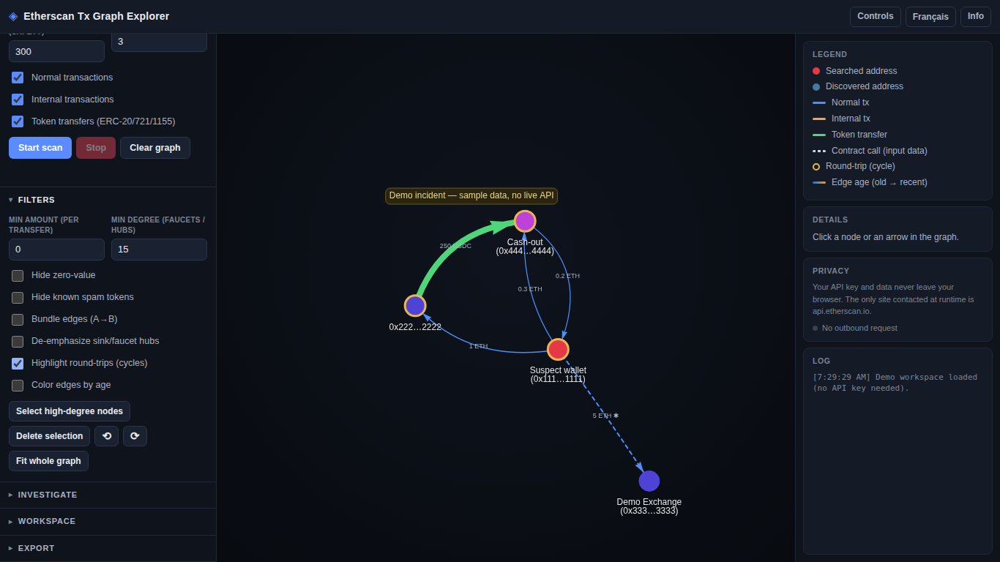
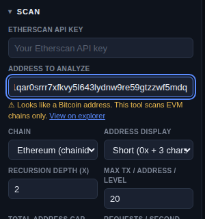

# Learn: how a blockchain works — with chainmap

[← Back to README](../README.md) · **English** · [Français](LEARN.fr.md)

A **hands-on curriculum**. Each concept below maps to something you can *see and do* in
the tool. Open **Demo mode** (no API key needed) and follow along.

---

## Contents

1. [Accounts & addresses](#1-accounts--addresses)
2. [Transactions — three families](#2-transactions--three-families)
3. [Value, base units & decimals](#3-value-base-units--decimals)
4. [Calldata & method selectors](#4-calldata--method-selectors)
5. [Tokens — ERC-20 / 721 / 1155](#5-tokens--erc-20--721--1155)
6. [The transaction graph & BFS expansion](#6-the-transaction-graph--bfs-expansion)
7. [Sampling ≠ full history](#7-sampling--full-history)
8. [Failed & reverted transactions](#8-failed--reverted-transactions)
9. [The EVM & multichain](#9-the-evm--multichain)
10. [Investigation heuristics](#10-investigation-heuristics)
11. [Hands-on labs](#hands-on-labs)

---

## 1. Accounts & addresses

An account on an EVM chain is identified by a 20-byte **address** — `0x` + 40 hexadecimal
characters (e.g. `0x742d…B78a`). Two kinds:

- **EOA** (externally-owned account) — controlled by a private key (a person/wallet).
- **Contract account** — code that runs when called.

> **In chainmap:** every node is an address. Paste one into *Address to analyze* — the
> **chain detector** under the field tells you instantly whether it's an EVM address
> (scannable here) or something else (Bitcoin, Solana, Tron…) and links you to the right
> explorer. Addresses are **lowercased** internally as their canonical id; the label you
> see (short form, your alias, or a known-address name) never changes that id.

## 2. Transactions — three families

chainmap fetches three kinds of activity (the three checkboxes):

- **Normal** — an EOA sends a tx (value transfer and/or a contract call).
- **Internal** — value moved *by contract code* during execution (not separately signed;
  reconstructed by the node's tracer).
- **Token transfers** — ERC-20 / ERC-721 / ERC-1155 movements (emitted as log events).

> **In chainmap:** each transfer becomes a directed **edge** from sender to receiver,
> colored by family (see the Legend). This is the core mental model: **a blockchain is a
> ledger of directed value movements**, and a graph is its natural shape.

## 3. Value, base units & decimals

Blockchains store amounts as **integers in the smallest unit** (wei for ETH: 1 ETH =
10¹⁸ wei). A token declares its own `decimals` (USDC uses 6). To show a human amount you
divide by `10^decimals` — using **big-integer math**, never floating point, or you lose
precision on large values.

> **In chainmap:** `formatUnits` does this with `BigInt`. If a token reports bad/missing
> decimals, the app flags the amount **"decimals unknown"** instead of silently showing a
> wrong number — an honesty rule that matters in forensics. Edge width is **weighted by
> amount**, so large flows are literally thicker.

## 4. Calldata & method selectors

*What* a transaction did. A tx can carry **input data** (calldata). A plain ETH transfer
has empty calldata (`0x`). A contract call encodes a **4-byte method selector** (first 4
bytes of `keccak256("transfer(address,uint256)")` = `0xa9059cbb`) followed by ABI-encoded
arguments.

> **In chainmap:** edges whose tx carried calldata are drawn **dashed with a `✱`** — spot
> contract interactions at a glance. Click one: the details panel **decodes the selector**
> to its human signature and **decodes the leading arguments**. This matters for
> investigators: a *normal* tx calling `transfer()` has its `to` set to the **token
> contract**, while the **real recipient** is hidden in the calldata — chainmap surfaces it.

## 5. Tokens — ERC-20 / 721 / 1155

- **ERC-20** — fungible tokens (USDC, DAI). `transfer(to, amount)`.
- **ERC-721** — NFTs; each has a unique `tokenId`.
- **ERC-1155** — multi-token; both fungible and non-fungible ids in one contract.

> **In chainmap:** token edges are deduplicated on a **precise key**
> (`action | hash | from | to | contractAddress | tokenID | logIndex`). Symbol is *not*
> part of the key — two different contracts can both call themselves "USDC", and one
> ERC-1155 tx can move several token ids. Collapsing on symbol would merge distinct
> movements; chainmap keeps them separate.

## 6. The transaction graph & BFS expansion

Starting from your address (the **root**, red), chainmap looks at its counterparties, then
*their* counterparties, and so on — a **breadth-first search (BFS)** over the address
graph. *Recursion depth* controls how many hops out it goes. Node color encodes depth.

> **In chainmap:** raise *Recursion depth* to widen the investigation. Guards keep it
> bounded and cheap: a per-address sample size, a hard **safety cap** on total addresses,
> and a **Stop** that truly aborts in-flight requests. Use **Estimate scan** first to
> predict API calls + time before a big run.

## 7. Sampling ≠ full history

The forensic caveat. chainmap fetches the **latest N** transactions per address per type —
**not** the complete history. This keeps scans fast and cheap, but it means the graph is a
**sample**.

> **In chainmap:** a persistent banner and the CSV export both state this. **Rule:** never
> present a sampled graph as complete or forensic. Increase the per-address limit if you
> need more, and always note the sampling in findings.

## 8. Failed & reverted transactions

A transaction can be *included in a block yet fail* (out of gas, a `revert`). It costs gas
but **moves no value**. Etherscan marks these (`isError = "1"`, `txreceipt_status = "0"`).

> **In chainmap:** failed txs are **dropped before drawing edges** — a reverted transfer
> must never appear as real money movement.

## 9. The EVM & multichain

Ethereum, BSC, Polygon, Arbitrum, Optimism, Base, Avalanche, Sonic… are all
**EVM-compatible**: same address format, same tx model. They differ by **chain id**.
Etherscan v2 exposes them through **one endpoint**, selected by a `chainid` parameter.

> **In chainmap:** the *Chain* selector just changes `chainid`. Because every EVM chain
> shares the `0x`-40-hex format, an address alone **cannot** tell you which chain (or
> mainnet vs testnet) it belongs to — you need transaction context. The chain detector
> makes this limitation explicit.

## 10. Investigation heuristics

Turning data into leads. Real blockchains are noisy. chainmap encodes patterns
investigators look for:

- **Amount / date / zero-value / spam filters** — cut noise to see the signal.
- **Edge bundling** — collapse many A→B transfers into one weighted arrow ("N tx, total X").
- **Sink / faucet hubs** — addresses that mostly *receive* (sink) or mostly *send*
  (faucet), often exchanges/mixers/airdrops; de-emphasized so they don't dominate.
- **Round-trips (cycles)** — value that returns to where it came from (A→B→A, or longer
  loops) is a classic **layering / wash-trading** signal. Tarjan's SCC algorithm rings
  every address on a cycle.
- **Color by age** — old flows cool/dim → recent flows warm/bright, to read tempo.
- **Known-address labels & risk flags** — a bundled local list names well-known entities —
  not just contracts (WETH, USDC, routers) but **exchanges, bridges, mixers, and
  OFAC-sanctioned addresses**, across several chains — with **no network lookup**. The
  high-signal categories drive the **risk flags**: an edge whose recipient is a mixer,
  bridge, or sanctioned entity is escalated on the graph, and a node's details panel shows
  the label plus a **Source** line giving the label's provenance (e.g. an OFAC action, or a
  public explorer label). The list is a **dated snapshot, not a live sanctions feed** —
  verify against the live OFAC SDN list before acting on a `sanctioned` hit.
- **Per-node risk score** — an *explainable* triage number combining the above (on a cycle,
  hub, high degree, contract calls, known entity). Click a node to see the score **and
  every reason** — no black box.

---

## Hands-on labs

Load **Demo mode**, then work through these. Each names the concept(s) it exercises.

1. **Read the graph.** Identify the root (red). Follow the arrows — who sent to whom, and
   how much? Which edge is thickest, and why? *(→ Transactions, Value & decimals)*
2. **Find the contract call.** One edge is dashed with `✱`. Click it: what method was
   called? What were the decoded arguments? Why is a *value transfer* also a contract call?
   *(→ Calldata & selectors)*
3. **Spot the layering.** Turn on **Highlight round-trips**. Which addresses get an amber
   ring? Trace the cycle by hand. Why is a returning flow suspicious?
   *(→ Investigation heuristics)*
4. **Cut the noise.** Set a *Min amount*, toggle *Hide zero-value*, then **Bundle edges**.
   How does the readable signal change? *(→ Investigation heuristics)*
5. **Triage by risk.** Click each node and read its **Risk** row. Rank the addresses.
   Which would you investigate first, and what evidence drives that?
   *(→ Investigation heuristics)*
6. **Respect the sample.** Note the sampling banner. If this were real, what would you need
   to do before calling any conclusion complete? *(→ Sampling)*
7. **Detect the chain.** Paste a Bitcoin address (`1A1zP1eP5QGefi2DMPTfTL5SLmv7DivfNa`) into
   the address field. What does chainmap tell you, and why can't it scan it?
   *(→ Accounts, Multichain)*
8. **Produce evidence.** Add a sticky note, export **PNG** and **CSV**. What does the CSV
   preserve that the picture doesn't? *(→ Export panel)*

*Instructor tip:* build a small `data/demo-workspace.json` of a known incident and have
students reconstruct the story from the graph alone.

---

[← Back to README](../README.md) · [Français](LEARN.fr.md)
